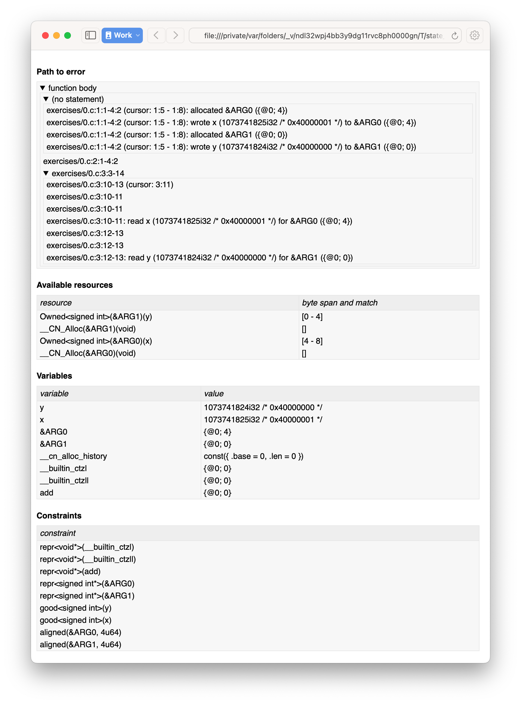

# Basic usage

## First example

For a first example, let’s look at a simple arithmetic function: `add`, shown below, takes two `int` arguments, `x` and `y`, and returns their sum.

<!-- 
  TODO: BCP: We should probably adopt the convention that all the files in the
  exercises directory have a comment at the top giving their name.  (We could
  actually auto-generate those header comments when we process /src/examples
  into build/exercises, to avoid having to maintain them and possibly get them
  wrong...)
-->

```c title="exercises/add_0.c"
--8<--
exercises/add_0.c
--8<--
```

Running CN on the example produces an error message:

```
cn exercises/add_0.c
[1/1]: add
exercises/add_0.c:3:10: error: Undefined behaviour
  return x+y;
         ~^~

an exceptional condition occurs during the evaluation of an expression (§6.5#5)
Consider the state in
/var/folders/_v/ndl32wpj4bb3y9dg11rvc8ph0000gn/T/state_393431.html
```

CN rejects the program because it has _C undefined behaviour_, meaning it is
not safe to execute. CN points to the relevant source location, the addition
`x+y`, and paragraph §6.5#5 of the C language standard that specifies the
undefined behaviour. It also puts a link to an HTML file with more details on
the error to help in diagnosing the problem.

Inspecting this HTML report (as we do in a moment) gives us possible example values for `x` and `y` that cause the undefined behaviour and hint at the problem: for very large values for `x` and `y`, such as `1073741825` and `1073741824`, the sum of `x` and `y` can exceed the representable range of a C `int` value: `1073741825 + 1073741824 = 2^31+1`, so their sum is larger than the maximal `int` value, `2^31-1`.

Here `x` and `y` are _signed integers_, and in C, signed integer _overflow_ is undefined behaviour (UB). Hence, `add` is only safe to execute for smaller values. Similarly, _large negative_ values of `x` and `y` can cause signed integer _underflow_, also UB in C. We therefore need to rule out too large values for `x` and `y`, both positive and negative, which we do by writing a CN function specification.


## First function specification

Shown below is our first function specification, for `add`, with a precondition that constrains `x` and `y` such that the sum of `x` and `y` lies between `-2147483648` and `2147483647`, so within the representable range of a C `int` value.

```c
--8<--
solutions/add_0.c
--8<--
```

In detail:

* Function specifications are given using special `/*@ ... @*/` comments, placed in-between the function argument list and the function body.

    <!-- TODO: BCP: We should mention the alternative concrete syntax, when it
    is decided and implemented. -->

    <!-- TODO: Add CN flag '--magic-comment-char-dollar' to switch CN comment
    syntax to '/*$ ... $*/'.  -->

* The keyword `requires` starts the precondition, a list of one or more CN conditions separated by semicolons.

* In function specifications, the names of the function arguments, here `x` and `y`, refer to their _initial values_. (Function arguments are mutable in C.)

* `let sum = (i64) x + (i64) y` is a let-binding, which defines `sum` as the value `(i64) x + (i64) y` in the remainder of the function specification.

* Instead of C syntax, CN uses Rust-like syntax for integer types, such as `u32` for 32-bit unsigned integers and `i64` for signed 64-bit integers to make their sizes unambiguous. Here, `x` and `y`, of C-type `int`, have CN type `i32`.

    <!-- TODO: BCP: I understand this reasoning, but I wonder whether it introduces more confusion than it avoids -- it means there are two ways of writing everything, and people have to remember whether the particular thing they are writing right now is C or CN... -->

* To define `sum` we cast `x` and `y` to the larger `i64` type, using syntax `(i64)`, which is large enough to hold the sum of any two `i32` values.

* Finally, we require this sum to be in-between the minimal and maximal `int` value. Integer constants, such as `-2147483648i64`, must specifiy their CN type (`i64`).

Running CN on the annotated program passes without errors. This means with our specified precondition, `add` is safe to execute.

We may, however, wish to be more precise. So far the specification gives no information to callers of `add` about its output. To also specify the return values we add a postcondition, using the `ensures` keyword.

```c title="solutions/add_1.c"
--8<--
solutions/add_1.c
--8<--
```

Here we use the keyword `return`, only available in function postconditions, to refer to the return value, and equate it to `sum` as defined in the preconditions, cast back to `i32` type: `add` returns the sum of `x` and `y`.

Running CN confirms that this postcondition also holds.

One final refinement of this example.  CN defines constant functions `MINi32`, `MAXi64`, etc. so that specifications do not need to be littered with unreadable numeric constants.

```c title="solutions/add_2.c"
--8<--
solutions/add_2.c
--8<--
```

Two things to note:

* These are constant _functions_, so they require a following `()`.
* The type of `MINi32()` is `i32`, so if we want to use it as a 64-bit constant
  we need to add the explicit coercion `(i64)`.

## Error reports

In the original example CN reported a type error due to C undefined behaviour. While that example was perhaps simple enough to guess the problem and solution, this can become quite challenging as program and specification complexity increases. Diagnosing type errors is therefore an important part of using CN. CN tries to help with that by producing detailed error information, in the form of an HTML error report.

Let’s return to the type error from earlier (`add` without precondition) and take a closer look at this report. The report comprises two sections.

<!-- TODO: BCP: It looks different now! -->
<div class="grid cards" markdown>
-   

    ---

    *CN error report*
</div>

*Path.* The first section, "`Path to error`", contains information about the control-flow path leading to the error.

When type checking a C function, CN checks each possible control-flow path through the program individually. If CN detects UB or a violation of user-defined specifications, CN reports the problematic control-flow path, as a nested structure of statements: paths are split into sections, which group together statements between high-level control-flow positions (e.g. function entry, the start of a loop, the invocation of a `continue`, `break`, or `return` statement, etc.); within each section, statements are listed by source code location; finally, per statement, CN lists the typechecked sub-expressions, and the memory accesses and function calls within these.

In our example, there is only one possible control-flow path: entering the function body (section "`function body`") and executing the block from lines 2 to 4, followed by the return statement at line 3. The entry for the latter contains the sequence of sub-expressions in the return statement, including reads of the variables `x` and `y`.

In C, local variables in a function, including its arguments, are mutable and their address can be taken and passed as a value. CN therefore represents local variables as memory allocations that are manipulated using memory reads and writes. Here, type checking the return statement includes checking memory reads for `x` and `y`, at their locations `&ARG0` and `&ARG1`. The path report lists these reads and their return values: the read at `&ARG0` returns `x` (that is, the value of `x` originally passed to `add`); the read at `&ARG1` returns `y`. Alongside this symbolic information, CN displays concrete values:

* `1073741825i32 /* 0x40000001 */` for x (the first value is the decimal representation, the second, in `/*...*/` comments, the hex equivalent) and

* `1073741824i32 /* 0x40000000 */` for `y`.

For now, ignore the pointer values `{@0; 4}` for `x` and `{@0; 0}` for `y`.

These concrete values are part of a _counterexample_: a concrete valuation of variables and pointers in the program that that leads to the error. (The exact values may vary on your machine, depending on the version of Z3 installed on your system.)

*Proof context.* The second section, below the error trace, lists the proof context CN has reached along this control-flow path.

"`Available resources`" lists the owned resources, as discussed in later sections.

"`Variables`" lists counterexample values for program variables and pointers. In addition to `x` and `y`, assigned the same values as above, this includes values for their memory locations `&ARG0` and `&ARG1`, function pointers in scope, and the `__cn_alloc_history`, all of which we ignore for now.

Finally, "`Constraints`" records all logical facts CN has learned along the path. This includes user-specified assumptions from preconditions or loop invariants, value ranges inferred from the C-types of variables, and facts learned during the type checking of the statements. Here (`add` without precondition) the only constraints are some contraints inferred from C-types in the code.

* For instance, `good<signed int>(x)` says that the initial value of `x` is a "`good`" `signed int` value (i.e. in range). Here `signed int` is the same type as `int`, CN just makes the sign explicit. For integer types `T`, `good<T>` requires the value to be in range of type `T`; for pointer types `T` it also requires the pointer to be aligned. For structs and arrays this extends in the obvious way to struct members or array cells.

* `repr<T>` requires representability (not alignment) at type `T`, so `repr<signed int*>(&ARGO)`, for instance, records that the pointer to `x` is representable at C-type `signed int*`;

* `aligned(&ARGO, 4u64)`, moreover, states that it is 4-byte aligned.

## Another arithmetic example

Let’s apply what we know so far to another simple arithmetic example.

The function `doubled`, shown below, takes an int `n`, defines `a` as `n` incremented, `b` as `n` decremented, and returns the sum of the two.

<!-- TODO: BCP: Is it important to number the slf examples?  If so, we should do it consistently, but IMO it is not. -->
```c title="exercises/slf1_basic_example_let.signed.c"
--8<--
exercises/slf1_basic_example_let.signed.c
--8<--
```

We would like to verify this is safe, and that `doubled` returns twice the value of `n`. Running CN on `doubled` leads to a type error: the increment of `a` has undefined behaviour.

As in the first example, we need to ensure that `n+1` does not overflow and `n-1` does not underflow. Similarly also `a+b` has to be representable at `int` type.

```c title="solutions/slf1_basic_example_let.signed.c"
--8<--
solutions/slf1_basic_example_let.signed.c
--8<--
```

We can specify these using a similar style of precondition as in the first example. We first define `n_` as `n` cast to type `i64` — i.e. a type large enough to hold `n+1`, `n-1` and `a+b` for any possible `i32` value for `n`. Then we specify that decrementing `n_` does not go below the minimal `int` value, that incrementing `n_` does not go above the maximal value, and that `n` doubled is also in range. These preconditions together guarantee safe execution.

To capture the functional behaviour, the postcondition specifies that `return` is twice the value of `n`.

## Exercise

*Quadruple.* Specify the precondition needed to ensure safety of the C function `quadruple`, and a postcondition that describes its return value.

```c title="exercises/slf2_basic_quadruple.signed.c"
--8<--
exercises/slf2_basic_quadruple.signed.c
--8<--
```

*Abs.* Give a specification to the C function `abs`, which computes the absolute value of a given `int` value. To describe the return value, use CN’s ternary "`_ ? _ : _`" operator. Given a boolean `b`, and expressions `e1` and `e2` of the same basetype, `b ? e1 : e2` returns `e1` if `b` holds and `e2` otherwise.

```c title="exercises/abs.c"
--8<--
exercises/abs.c
--8<--
```
