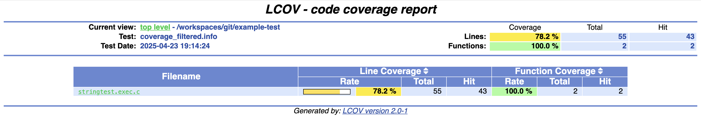
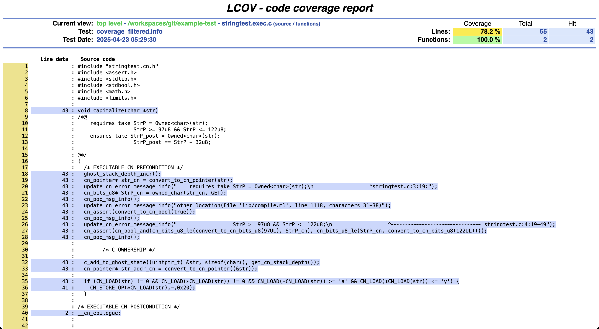
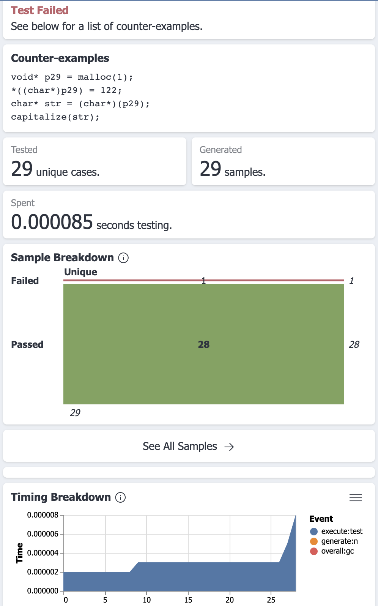

# Understanding and controlling test distributions

Automatic test generation is powerful,
but it has its limits,
so it is important to understand how the tests are performing.

We'll explore:

- how to generate coverage reports
- get information about specific test inputs
- adjust the distribution of inputs

## Coverage reports using `lcov`

CN's testing framework supports the generation of code coverage information via the [`gcov`](https://gcc.gnu.org/onlinedocs/gcc/Gcov.html) agent and [`lcov`](https://github.com/linux-test-project/lcov) coverage-data visualizer.

To generate coverage data, run CN with the `--coverage` switch. This will cause `gcov` to be run and `lcov`'s viewable files to be placed into a subdirectory, `html`, within the working directory. These include both line-by-line coverage data and summaries for each function.

 *N.B.:* `lcov`'s line-by-line data is not broken down by individual test inputs, but shows only totals for the entire test run.

## Analytics with Tyche

CN's testing framework supports output to [Tyche](https://harrisongoldste.in/papers/uist24-tyche.pdf), a tool designed for interactive visualization of property-based test results.

To start, run `cn test` with the `--output-tyche` switch. The following command will run CN and output results in Tyche format to `results.jsonl`:

`cn test --output-tyche results.jsonl ...`

 Once such a file has been generated, it may be loaded into Tyche. Tyche is distributed as [a web application](https://tyche-pbt.github.io/tyche-extension/) and as [a Visual Studio Code extension](https://marketplace.visualstudio.com/items/?itemName=HarrisonGoldstein.tyche). The latter, once installed, may be accessed by invoking the "Tyche: Open" command.

 When the output file is loaded into Tyche, the first view will be a list of functions tested (if more than one). Clicking on any one of these will bring up the main view as shown in the screenshot following. This provides access to detailed information about the test run, including the total number of inputs, timing data, pass/fail numbers, and a serialization of each different input. If there was a failure, the "counterexample" input that caused the failure will be shown.

## Tweaking the distributions

- Using `assert` to skew distributions
  {{ todo("Ideally, should support multiple specs, with some for testing only") }}
    - Comparison to partition testing
- `--max-array-length`?
